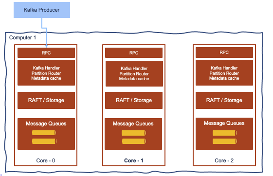

# Architecture

It uses the [Raft consensus algorithm](https://raft.github.io/) with is a proven distributed consensus protocol: recall that **consensus** involves multiple servers agreeing on values. The algorithm is well [explained here](http://thesecretlivesofdata.com/raft/) and can be summarized as:

* a node has 3 states: Follower, Candidate or Leader
* all nodes starts as a follower. But if they do not get info from a Leader they can become a candidate
* candidate requests votes from other nodes
* candidate becomes the leader if it gets votes from a majority of nodes. Requiring a majority of votes guarantees that only one leader can be elected per term.
* the leader is getting write/ read operations
* node uses log to keep command of what to do, it pushes replicas to followers, once a majority of nodes have written the entry, then it commits the change, and then notifies the followers that the entry is committed.
* The cluster has now come to consensus about the system state.
* For leader election uses 2 timers:
    
    * election timeout (150ms to 300ms) is the amount of time a follower waits until becoming a candidate. Once it votes for itself, it sends Request Vote messages to other nodes.
    * Heartbeat timeout, controls how often Append Entry messages are sent to followers. Data received from external clients are carried in the Append Entry messages.

* Raft can stay consistent in the face of network partitions

* It supports WASM ([WebAssembly](https://webassembly.org/)) engine to do inline message transformation between topics via uploading WASM script. The Kafka Stream pattern of *consume - process - produce* is using network communication that is not efficient.
* For fraud tolerance, Red Panda is easier to manage as it support a single fault domain, with just one distributed system protocol, while Kafka with Zookeeper and the in-synch protocol has two fault domains, two consensus protocols, which complexifies the problem investigation and the recovery. 
* Shadow indexing feature helps to upload the append log to long persistence storage like s3, COS with indexing. No need for mirror maker. Ask s3 to do replication between DCs, but index is also copied, so historical access is kept. RedPanda guarantees the access and encapsulates that, still using Kafka API. Super cheap using s3 replication.
* Use the Seastar framework: supports async programming model via futures and promises. Thread-per-core architecture elinates global locks and minimizes I/O blocking, reducing context switching costs.
* Direct I/O management done by red panda, uses in memory object cache, save to disk after each batch of records. A portion of the memory can be allocated to historical records and portion for fresh written records.  

* It is C++ implementation.

## Schema registry

Support Confluent Schema registry.

???- "Read more"
    * [Raft consensus algorithm](http://thesecretlivesofdata.com/raft/)
