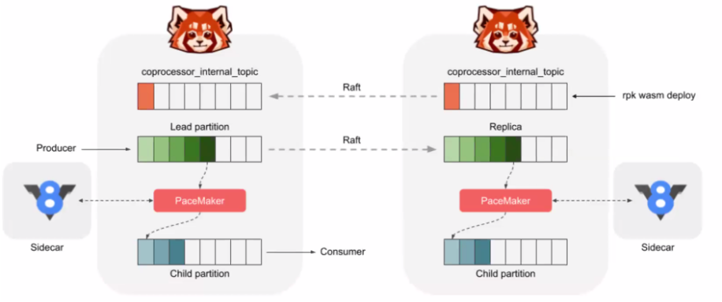

# [Red Panda](https://redpanda.com/)

Redpanda is a new storage engine, optimized for streaming data, using a thread-per-core architecture focused on delivering stable tail-latencies

## Context

* Companies are not happy to run Kafka, and when they have deep knowledge, they struggle with performance
* Better hardware with more cache, NUMA architecture, faster drive SSD, cloud container and kbernetes. 
* RedPanda scales more easily and delivers consistently low latencies with a much lower hardware footprint, and with data safety.
* To get strong guarantee in Kafka you need to flush message to disk, and it is too slow.

Red Panda is a good fit for companies doing large scale data streaming without data loss and also in the use case of resource consumption reduction

## Value Propositions

* Kafka compatible cluster. C++ engine.
* Single binary to deploy. No more zookeeper. It uses the Raft consensus algorithm internally.
* Up to 10x lower tail latencies and 6x faster Kafka transactions on fewer resources.
* Zero data loss by default, highly available and predictable performance at scale
* Limitless processing of both real-time and historical data through a single API.
* Redpanda Keeper (RPK) automatically tunes your kernel to yield the optimal settings for your hardware
* Transform data with our WebAssembly-based engine: 60% of streaming programming is for doing data manipulation, so to avoid data ping-pong that exists with existing streaming platform, move logic like filtering, data normalization, scrubbing, cleaning in the broker or in sidecar close to it. A wasm engine executes the code. Any wasm modules is supported.

With [cloud offering](https://redpanda.com/cloud/)

* Automated backups to S3/GCS
* JVM app tends to have some latency issue while GC (2 to 6s), but with Kafka messaging that will impact throughput too. An asynch write on a file, will put some performance barrier on the OS Kernel, code has to wait the flush to disk to complete. RedPanda uses batch and debouncing the write operations. No page cached is used, so no lock is used on the kernel (file handlers) to save to dick. File space and metadata are preallocated: No synchronization of the file metadata at the linux kernel.
* Result 4x throughput and 100x latency improvements
* The autotuner feature is a tool to assess what the best settings and configurations for running the system: the linux kernel is optimized: network interface, Non-volatile Memory express device (NVMe)
* Single binary includes broker, HTTP proxy, schema registry
* Native Prometheus and Grafan integration. Support consumer lag metrics.
* Terraform and ansible templates available
* Automatic leader and partition rebalancing, 

### EDA positioning

* Many of the benefits of an event-processing system can be found in a simple **pub/sub** process or database that collects events from application components and makes them available to other components.
* Data as a product: you transform your event stream from individual actions into a warehouse of information about everything that happens in your application

### Kafka counters

* Kafka’s default configuration may acknowledge writes before fsync. This might allow Kafka to lose messages when nodes fail.

### Performance

* uses DMA (Direct Memory Access) for all its disk IO
* place the data directory (/var/lib/redpanda/data) on an XFS partition in a local NVMe SSD
* automatically chooses the best setting to drive high throughput traffic to the machine.
* everage `cgroups` to isolate the Redpanda processes
* leverage `systemd` slices, to strongly prefer evicting other processes before evicting RedPanda process’ memory and to reserve IO quotas and CPU time
* CPU is configured for predictable latency at all times

### Tiered Storage

Tiered Storage allows you to save storage costs by offloading log segments to cloud storage. You can specify the amount of local storage that you want to provision and configure Tiered Storage to move the rest to Amazon S3 or Google Cloud Storage.

Redpanda Tiered Storage works behind the scenes to index where data is offloaded so that it can retrieve the data when you need it.

You can enable Tiered Storage for a cluster or for a topic.

Remote write is the process that constantly uploads log segments to cloud storage. The process is created for each partition and runs on the leader node of the partition.

### The Kafka API

Kafka API, and Kafka streams are the winner for integrating and processing data streams. Has millions of line of code. Just change the backbone.

RedPanda guarantees compatibility.

REST request / response is supported with Kafka REST proxy, and RedPanda offers the same capability. With this API you can replace MQ based product.

Kafka API had knowledge of the cluster, bootstrap servers, broker lists, partition leader...

But per say Kafka Stream is not that efficient as the `consume - processing - produce` is using network communication, so this transformation can be better be done with WASM.

### Wasm engine

JavaScript allowed developers to turn static content into the immersive web experiences of today, fundamentally changing the web by shipping code to the user’s computer. Wasm empowers the engineer to transform Redpanda, by shipping computational guarantees (code) to the storage engine. It simply inverts the relation of shipping data to compute by shipping code to data.

[Redpanda Transforms](https://redpanda.com/blog/wasm-architecture/) is based on [Google V8 engine](https://v8.dev/) and runs in sidecar or within broker.

There are 2 types of engines inside Redpanda. The first is for synchronous functions that are in the hot request-response path: transformation function is called before writing the data to the disk. The other is for stateful transformations that are always asynchronous.

Current GA feature is the async processing, which is using a child topic-partition created with parent topic creation.

Record written to the parent topic, but the transformation will work on each replicas and write to the child. Consumers poll from child topic. Transformation function needs to be idempotent.


See [data transformation with web assembly section](/#data-transformation-with-webassembly) and [Red Panda article](https://redpanda.com/blog/wasm-architecture/)

## Getting started

See [Platform to install the product](https://redpanda.com/platform/), or docker

`brew install vectorizedio/tap/redpanda`

```sh
docker run -d --pull=always --name=redpanda-1 --rm \
-p 8081:8081 \
-p 8082:8082 \
-p 9092:9092 \
-p 9644:9644 \
docker.redpanda.com/vectorized/redpanda:latest redpanda start --overprovisioned \
--smp 1  --memory 1G --reserve-memory 0M --node-id 0 --check=false
# Start a shell
docker exec -ti redpanda-1 bash
# use rpk commands
```

See also the docker compose under [studies/redpanda](./studies/redpanda) folder.

### [rpk common commands](https://docs.redpanda.com/docs/reference/rpk-commands/)

```sh
# on macos directly
rpk container start
# cluster
rpk cluster info --brokers ....
# Topic
rpk topic create twitch_chat --brokers=localhost:9092
# produce text message like kafka-console-producer
rpk topic produce twitch_chat --brokers=localhost:9092
# Consume
rpk topic consume twitch_chat --brokers=localhost:9092
# Edit cluster config
rpk cluster config edit
```

## [Data transformation](https://docs.redpanda.com/docs/data-management/data-transform/) with WebAssembly 

Code is created in javascript or any language supporting wasm generation.

```sh
rpk wasm generate program-name
```

Then code is pushed to RedPanda and persisted in a compacted topic so only the last version of code is available:

```sh
rpk wasm deploy --name="encrypt-name" main.js
```



`Pacemaker` actively listens for the registration of new scripts (.wasm + .js) via `rpk wasm deploy` and starts a watch on all new incoming data for the registered topics. The pacemaker is critical for crash recovery. In essence the pacemaker keeps a map of Wasm scripts to offset state. 

Stateful transforms execute at the lowest level of the storage engine - the partition - and inherit the same partition scalability of the parent stream.

At any point in time we can say exactly what scripts are running in the system, on what computers, for what input topics, and we can revoke them and inspect them at runtime.


???- "Compendium"
    * [Podcast - simplify your streaming data workloads with Red Panda.](https://www.dataengineeringpodcast.com/vectorized-red-panda-streaming-data-episode-152/)
    * [Performance summit 2020](https://www.youtube.com/watch?v=wwU58YMgPtE&t=1944s)
    * [Helm chart]()
    * [Alpaca Launches Next-Gen Order Management System That Makes Order Processing 100x Faster](https://alpaca.markets/blog/alpaca-launches-next-gen-order-management-system/)
    * [Code generation in Redpanda](https://redpanda.com/blog/codegen/)


